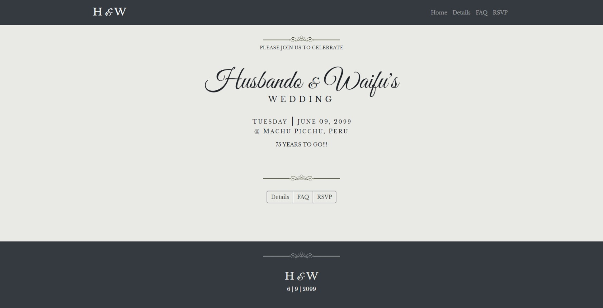
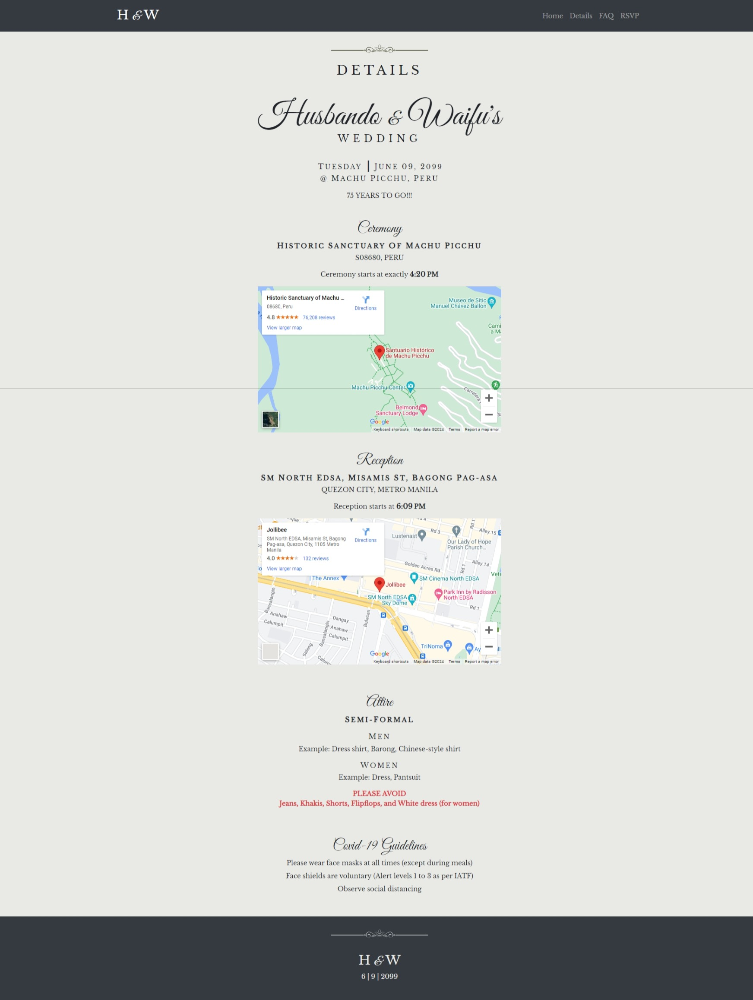
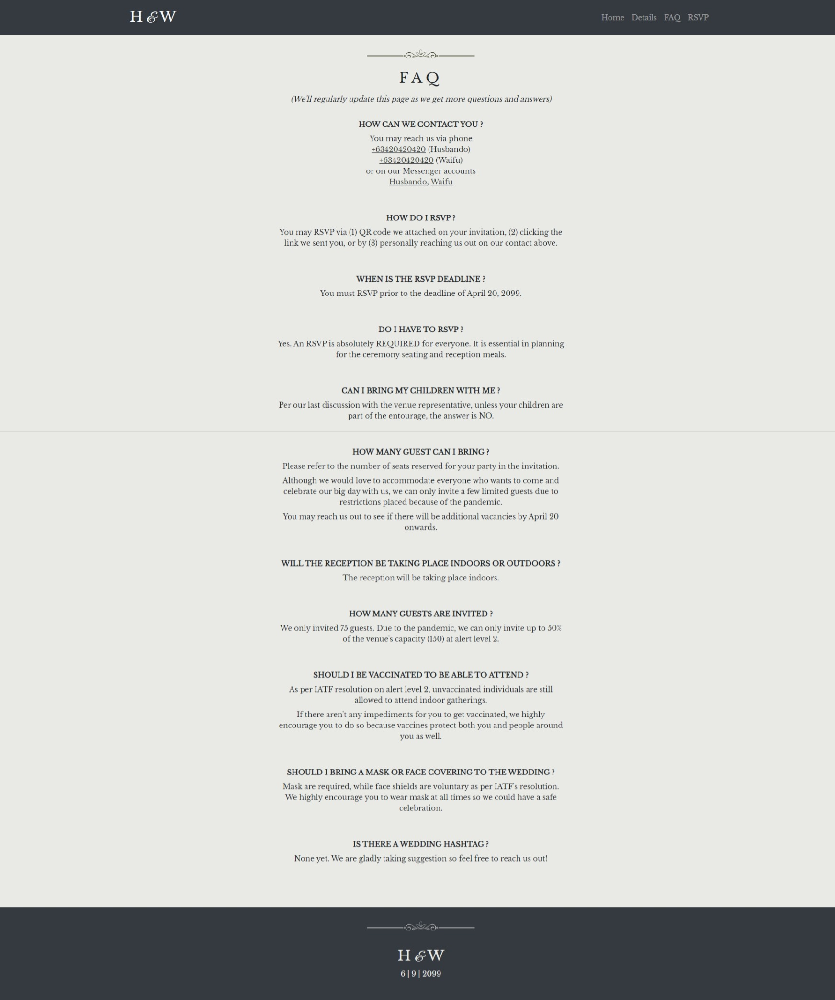
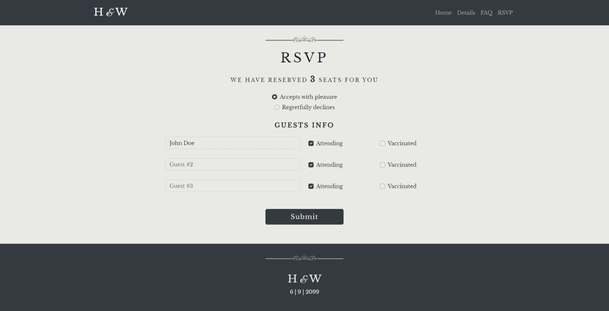
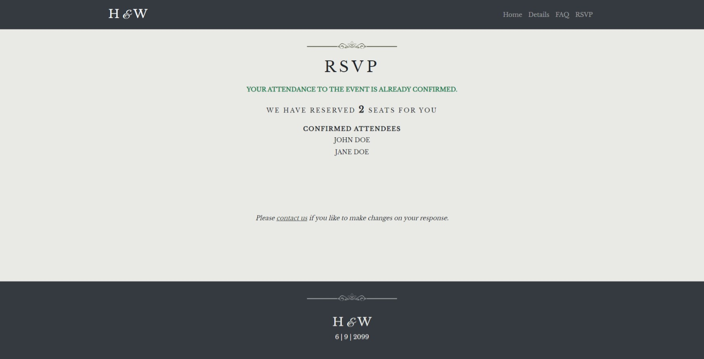
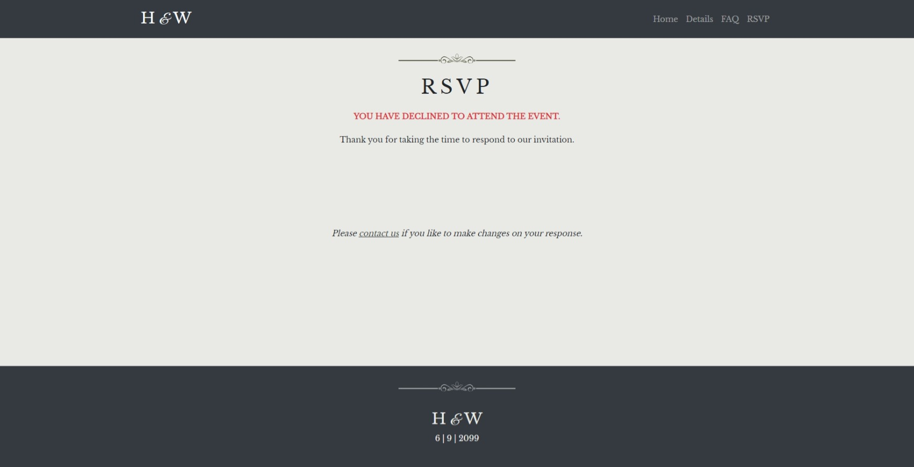

# Save the Date Frontend

This is a simple RSVP app that I hacked for a couple of hours for my own wedding a few years ago.
Some changes were made in order to remove personal information from the original code and make things more configurable. Refer to the .env for the environment variables you need to configure.

Created with the following libraries:

- Bootstrap
- Next / React
- CSS Modules

The code for the backend is placed [here](https://github.com/jannoelc/savethedate-backend.git).

## Screenshots

### Home

### Details

### FAQs

### RSVP

